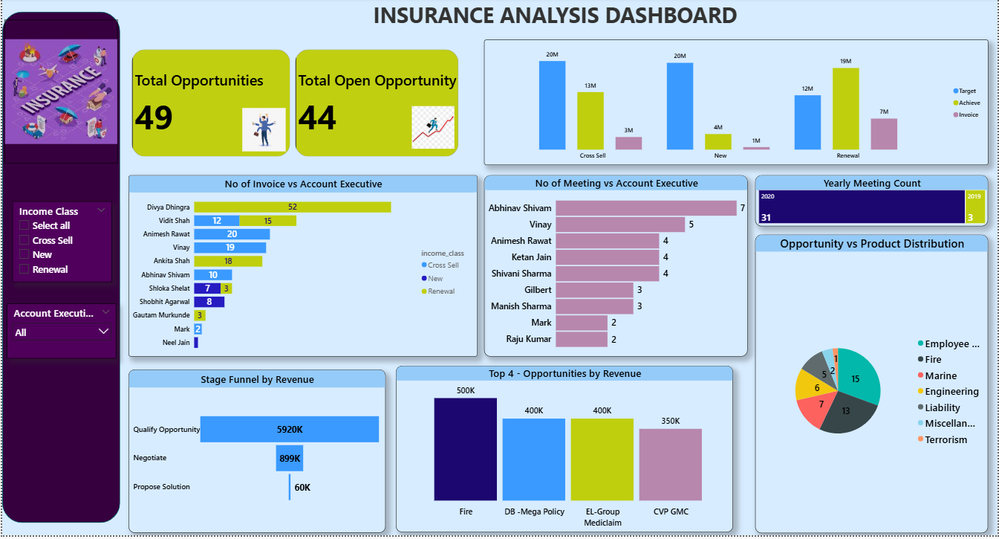
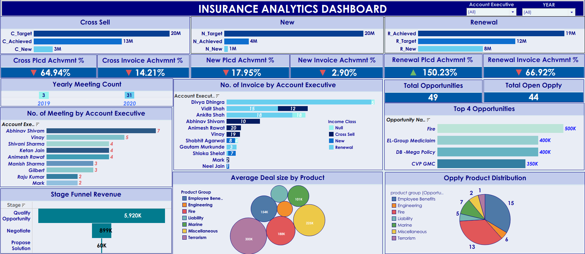
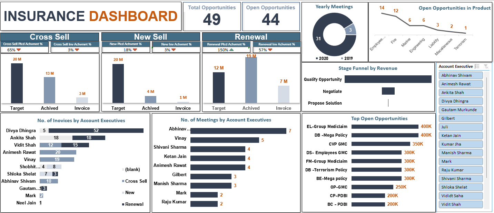

# 📊 Insurance Analytics Dashboard

## 📊 Overview
This project analyzes insurance sales performance, opportunity pipelines, and account executive productivity using data analytics techniques.

The objective of this project is to build a centralized analytics solution that helps management monitor revenue performance, evaluate pipeline health, and identify business opportunities.

The analysis was performed using SQL and Business Intelligence tools, and the results were visualized through interactive dashboards.

---

# 🔍 Key Highlights

• Total Opportunities: 49  
• Open Opportunities: 44  
• Revenue Analysis: New Business, Cross Sell, Renewal  
• Executive Productivity Metrics: Meetings & Invoices  
• Pipeline Stage Analysis for deal progress  

---

# 📈 Visual Insights

• Revenue comparison between **New Business, Cross Sell, and Renewal sales**  
• Opportunity distribution across insurance products  
• Account executive performance based on meetings and invoices  
• Sales pipeline stage funnel analysis  

---

# 🛠 Tools Used

• SQL  
• Microsoft Excel / CSV (Data Source)  
• Power BI  
• Tableau  
• Power Query  
• Data Visualization  

---

# 📊 Dashboards

## Power BI Dashboard

Interactive dashboard for analyzing revenue performance, opportunity pipeline, and executive productivity.

---

## Tableau Dashboard

Provides advanced visual analytics for revenue contribution and opportunity distribution.

---

## Excel Dashboard

Displays KPI overview and insurance sales performance monitoring.

---

# 📊 Key Business Insights

• Identified revenue contribution from **New Business, Cross Sell, and Renewal segments**  

• Highlighted **top performing account executives**  

• Detected **pipeline stages where opportunities are delayed**  

• Identified products generating the **highest opportunities**  

---

# 🚀 How to Use

1. Clone this repository
   
git clone https://github.com/Adlarakesh/insurance-analytics-project.git

2. Open the SQL file to view KPI calculations

3. Explore dashboard screenshots

4. Analyze datasets to understand business insights

---

# 🔮 Future Enhancements

• Add predictive analytics for revenue forecasting  

• Integrate real-time insurance datasets  

• Build automated data pipelines  

• Deploy dashboards using Power BI Service  

---

# 👨‍💻 Author

**Adla Rakesh Reddy**

🔗 LinkedIn: https://www.linkedin.com/in/rakeshadla 

💻 GitHub: https://github.com/Adlarakesh

